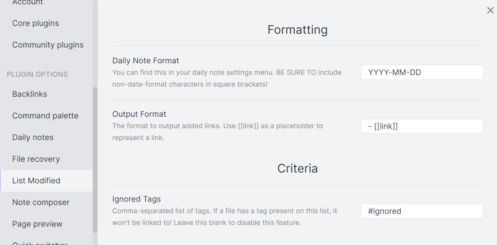
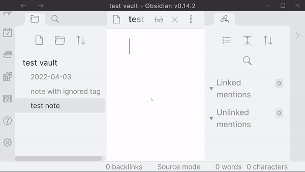

# Obsidian List Modified

This plugin links all modified files meeting certain criteria to a daily note. This provides an accurate log/archive of files modified on certain days.

Example:

Using these settings... (must see on GitHub, this won't display on Obsidian)



This is the result... (must see on GitHub, this won't display on Obsidian x2)



# Why?

As of now, dataview queries cannot be "frozen" in time. There are hacky solutions using templater, but I wanted something really simple.

# How?

When a file is modified, the plugin checks if there is already a link to the modified file inside of your daily note. If so, it doesn't need to link it again. Otherwise, If this modified file meets the criteria, it appends a link to the daily note.

# Criteria supported

## Ignored tags

Disables a modified note from linking if it contains a certain tag.

These tags will be recognized if they are in the note's content (#tag anywhere in your note)

or in its frontmatter in the following formats:

```yaml
---
tags: ['#your', '#tags', '#here']

# OR

tags:
    - '#your'
    - '#tags'
    - '#here'
---
```

## Excluded Folders

Disables a modified note from linking if it resides in a certain folder.

These folders should be relative to your vault root directory.

If my vault structure looks like this:

MyVault (root folder)

|\_ Top Folder One

| |\_ Second Folder One

| | |\_ FirstFile.md

| |\_ Second Folder Two

| | |\_ SecondFile.md

|\_ Top Folder Two

| |\_ ThirdFile.md

Using the following exclusion settings: "Top Folder One/Second Folder Two, Top Folder Two"

Only the FirstFile.md will be added to your list.

# Installation

**NOTE:** You must have safe mode shut off to be able to install community plugins such as this one!

## Community Plugin List (Recommended)

Simply search for "List Modified" on the community plugins browsing tab inside of Obsidian!

## Manual

1. Open your vault's folder in your file explorer
2. Make sure showing hidden files is enabled
3. Open the `.obsidian` folder, then open the `plugins` folder.
4. Create a new folder called `obsidian-list-modified`
5. Head over to the releases page and download the `manifest.json` and `main.js`
6. Add these files to the new folder you've created
7. Reload/restart Obsidian and enable the plugin in your community plugin settings

# Usage

The only things you need to configure are in the settings tab! After these are configured, the plugin should work automatically. Read the description of each setting carefully!

# Disclaimer

This plugin should not do any harm, but **you should back up just in case**. I am not responsible for any damage!
