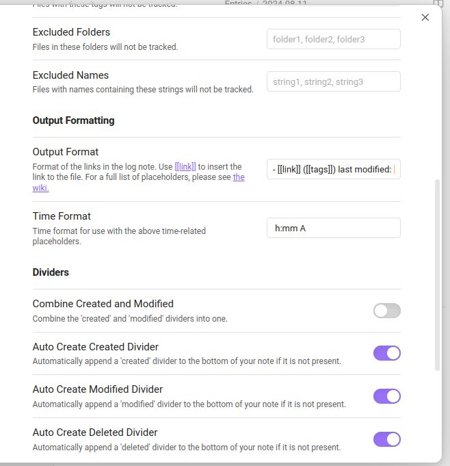
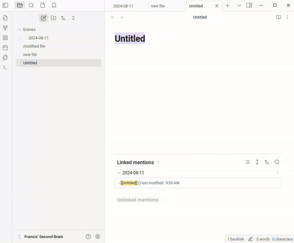

# Obsidian List Modified

This plugin links all modified files meeting certain criteria to a daily/weekly/monthly note. This provides an accurate log/archive of files modified during specific time periods.

List Modified outputs logs as standard text rather than dynamic queries, ensuring their persistence. Similarly, OLM does not rely on the system's file modification times, as they can be inaccurate when files are moved or when using sync services.

**Here's a little example...**

With these settings:

You can expect this!

## Usage & Config

Please read [the wiki](https://github.com/franciskafieh/obsidian-list-modified/wiki).

## Contributing

Read [the CONTRIBUTING.md file](CONTRIBUTING.md) for build and dev instructions.

## Donations

If OLM has helped you in any way, and you would like to fund future development, feel free to support me on Ko-fi! All donations are appreciated :)

## Similar Plugins

There are some purposes which are out of scope for this plugin. Here are some great plugins that may meet your needs.

-   If you are looking for a separate changelog note: [Obsidian Vault Changelog](https://github.com/badrbouslikhin/obsidian-vault-changelog/tree/main)
-   If you are looking for detailed change history (part-by-part) and analysis: [Obsidian Git](https://github.com/denolehov/obsidian-git)

## Disclaimer

This plugin should not do any harm, but **you should always back up your notes just in case!** I am not responsible for any damage done as a result of this plugin.
